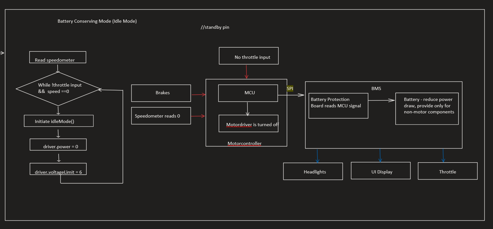

# bike-firmware

This is a collection of firmware written for Electrium Mobility, a University of Waterloo design team, for the electric bike project.

- **errorHandling/motor_driver.c**
  - This SPI communication code is used for detecting over-thermal and over-current detection using the readDRV8301() function. The writeDRV8301() function is used to talk to the device via the motor driver.
- **motorController/idle.c , motorController/init-motor-control/motorcontrol.c , motorController/regenbraking.c**
  - Subsystems written for the different functionalities of e-bike. Including setting up the motor controller, idle mode, and regenerative braking. Throttle input conversion to digital signal is still TO-DO.

#### Software Block Diagrams

##### Motor Control Diagram

##### Battery Saving Mode Diagram

<!--##### Regen Braking Diagram!-->
<!--!-->

